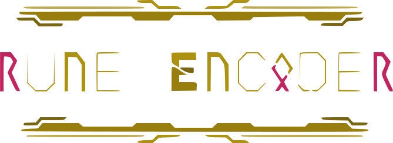

# My React-Portfolio 
  

## Description

Deployed Website URL: **[My Portfolio URL](https://christian-palacios-portfolio.netlify.app/)**

Welcome to my **React-Portfolio** – a dynamic web application meticulously created to introduce myself to the world. This project was born from the desire to infuse it with a unique style, a reflection of my personality, and hard work.  

Within this React portfolio, I offer you insights into my background and ways to get in touch, along with access to my professional resume.  

Here's what you can look forward to:

- **Header & Navigation:**
- **About Me:** Dive into my personal journey, passions, and individuality, as I share my unique style and personality.
- **Portfolio:** Explore a showcase of my projects. View contains images, project links, and GitHub repositories.
- **Contact:** Easily connect with me and reach out to initiate meaningful interactions.
- **Resume:** Discover a comprehensive display of my skills, experience, and qualifications, showcasing my professional journey.
- **Footer:** Convenient quick links to my GitHub, LinkedIn, Indeed, and more so you may get to know me better.

## Table of Contents

- [Installation](#installation)
- [Usage](#usage)
- [Technologies Used](#technologies-used)
- [License](#license)
- [Credits and Questions](#credits-and-questions)

## Installation

**N/A**

## Usage

Navigate to the following URL: **[My Portfolio URL](https://christian-palacios-portfolio.netlify.app/)**

## Technologies Used

Here are the technologies and tools that power my React-Portfolio:

- **React:** The heart and soul of the application.
- **React Router:** Seamlessly navigate between sections.
- **Vite:** The lightning-fast build tool.
- **Netlify:** Where your portfolio takes flight (for deployment).

## License

## Credits and Questions

**Here is a link to my Github Profile: [Profile Link: rune-encoder](https://github.com/rune-encoder)**

**If you would like to check out my other projects visit this link: [Projects Link: rune-encoder](https://github.com/rune-encoder?tab=repositories)**

  

**_Created By: Christian Palacios_**

  

